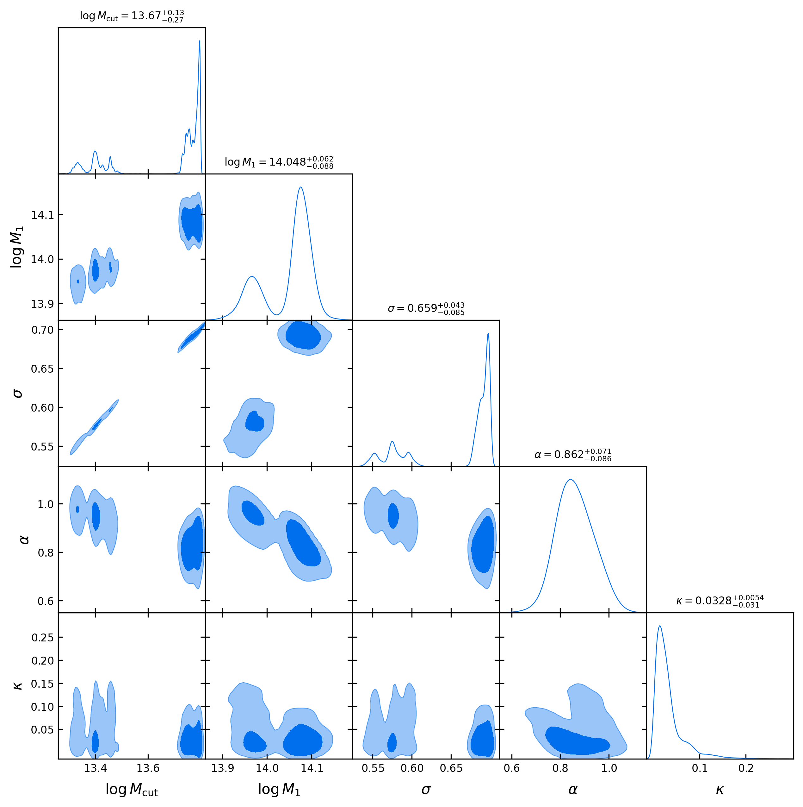

# Mocks with AbacusHOD

Here we generate galaxy mocks using AbacusHOD. 

## Pre-requisites

### AbacusUtils

You need the package `AbacusUtils` to read the files in the data products of AbacusSummit. 
AbacusHOD is a part of this package.
For DESI members, refer to the [wiki](https://desi.lbl.gov/trac/wiki/CosmoSimsWG/Abacus#AbacusSummit).

On `NERSC`, in brief, you may need first load the **environment** by 
```sh
source /global/common/software/desi/desi_environment.sh
```
Then I forked https://github.com/abacusorg/abacusutils.git and git cloned it to my `~/lib` directory.
```sh
git clone https://github.com/SiyiZhao/abacusutils.git
cd abacusutils
pip install -U -e ./
```

==Attention==: We modify the `class AbacusHOD` in `AbacusUtils` to speed up the `compute_multipole` method, which is used in the HOD fitting. The origional version return `[wp, xi_l]`, we delete the `wp` part. To directly use our fitting code, please `git clone` my repository of `AbacusUtils` (https://github.com/SiyiZhao/abacusutils.git).

### CorrFunc

`AbacusUtils` uses `CorrFunc` to compute the correlation functions. [Corrfunc](https://github.com/manodeep/Corrfunc) can be easily installed by following the [guide in ReadMe](https://github.com/manodeep/Corrfunc?tab=readme-ov-file#method-1-source-installation-recommended).

I installed it into `$HOME/lib` and added the path to the enviroment variable `PYTHONPATH`:
```sh
export PYTHONPATH=$PYTHONPATH:$HOME/lib
```

### dynesty

In HOD fitting, we need `dynesty` for nested sampling. 
It can be installed by
```sh
pip install dynesty
pip install dill
```

`dill` is used to save and load the sampler.

## Works

### Mock generation & verification

We first generate a mock using the `AbacusHOD` with the parameters shown in [Yuan et al. 2024](https://arxiv.org/abs/2306.06314) to verify our pipeline. (Refer `run_mock.sh`.)

Take LRG in $0.6<z<0.8$ as an example. 
We take the simplest model "Zheng07+fic" in Table 3 of the paper. 
The mean values of the HOD parameters are $\log M_{\rm cut}=12.78$, $\log M_1=13.94$, $\sigma=0.17$, $\alpha=1.07$, $\kappa=0.55$.
We perform the HOD model on the snapshot $z=0.8$ of `AbacusSummit_base_c000_ph000_box`, as described in the paper. 
We compare the projected correlation function $w_p(r_p)$ with the Fig.8 (b) left panel. The results are 


The blue dots are the data they used for HOD fitting, and are available in [zenodo](https://zenodo.org/records/7972387). 
Our bins are slightly different from their bins, but the results are consistent. The first dot has poor covariance (the diagonal element is 0), and is not used in the fitting.
They use the log-midpoint of the bins as the $r_p$ values, so the comparison should be taken between the blue and green dots, while we also plot orange dots with the linear-midpoint as the bin center for reference.


### HOD fitting with Y3 data

Then we fit the AbacusHOD model to the DESI Y3 data.

#### basic test

We test our fitting pipeline by comparing with Hanyu's work on *DR2 Abacus High Fidelity Mocks* [reference TBD].
The test is done on:
- fit to small-scale clustering of LRGs at z=0.4-0.6 (loa-v1.1-pip), wp (0.03-39)Mpc/h + xi02 (0.2-39) Mpc/h, 
- HOD model: Zheng07+velocity bias
- simulation: `AbacusSummit_base_c000_ph000`, z=0.5
- Our current pipeline are differ from Hanyu's in:
  - assign satellite to particles rather than using NFW profile; this results in that our bestfit parameters work better than Hanyu's, we highlight it due to the different strategies of assigning satellites. 
  - sampler, we use `pymultinest`, it is fast while the posterior may not be so accurate.
- See the comparison in `compare_clus_z0.ipynb` which is not submitted to GitHub repo but can be sorted and distributed if neccessary.

#### move to PNG simulations

Then we apply the fitting pipeline to AbacusPNG simulations 'Abacus_pngbase_c300_ph000' ($f_{\rm NL}=30$).
The fitting results differ from those of the AbacusSummit simulation with fiducial cosmology, as the following plot shows, it indicates that PNG has influnces on small scale clusterings.


#### previous test

==In this test, we found that fitting results from $w_p$ and $[\xi_0, \xi_2]$ are inconsistent from each other. Learn from Hanyu that 1. in multipoles fitting, velocity bias parameters must be include; 2. it's better to fitting with the combined data vector $[w_p, \xi_0, \xi_2]$.==

We select the 'non-NAN' part of the clustering measurement, the s range is around 0.11-30 Mpc/h.

Info of the galaxy samples: 
- tracer: LRG
- z range is 0.6-0.8.
- fitting at the snapshot $z=0.8$ of `AbacusSummit`.

The results resampled by `getdist` are shown in the figure below. 
The posterior is kind of skewed, a possible reason is that there are randomness in the HOD model while we have not generated severval mocks for each point in parameter space and averaged them to supress the randomness. Anyway we try to use $w_p$ for fitting (as yuan+24 did) to see if things get better...



The best fit clustering is shown in the figure below. Though we only fit with $\xi_0$, we also show $\xi_2$ for reference. 


## Notes on AbacusHOD

[doc](https://abacusutils.readthedocs.io/en/latest/hod.html)

The `mass` refers to host halo mass and is in units of Msun/h. The `id` refers to halo id, and the `Ncent` key refers to number of central galaxies for that tracer. The first `Ncent` galaxies in the catalog are always centrals and the rest are satellites.