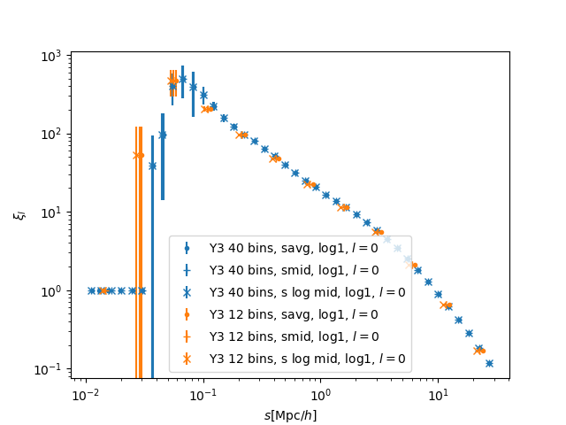
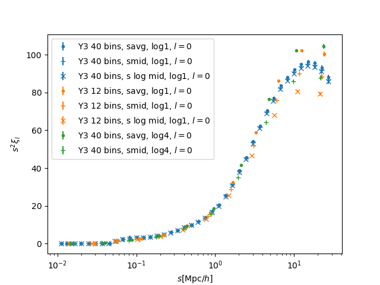

# Measure the clustering 

For the small-scale clustering data, we once keep the same with the data used in [DR2 Abacus High Fidelity Mocks](https://desi.lbl.gov/trac/wiki/CrossAnalysisInfrastructureWG/LSSMocks/DR2HFAbacusMocks) V1 (the DESI wiki page, log in required) except more redshift bins for the low-z QSOs. 
Then in `v2`, our clustering data should be the same as the data used in DR2 AbacusHF. 

We use the script `xirunpc.py` to measure the clustering of high-z QSOs, this script is same as `LSS/scripts/xirunpc.py`(a version in June, 2025). 
Refer `run_xirunpc_qso_rppi.sh` and `run_xirunpc_qso_smu.sh` for the measurement with several redshifts (pay attention that 4 hrs can only finish 2 runs), or `run_xirunpc.sh` for the measurements in one redshift bin.

# Out-of-date notes

We once combine the measurements of $w_p$ and $\xi_0$, $\xi_2$ to get the full data vector and covariance matrix, see `run_comb_wp_xi02.sh` for details. The selection of $r_p$ and $s$ bins are also performed there. 
But now, the data preparation and scale cut are done in the HOD fitting pipeline, say, `hod-variation/`, please refer the script there.

## LRGs

## QSOs

We define the redshift bins of QSOs as follows:
- 'z0': 0.8-2.1, center 1.4 -- a broad range which is not used in the final analysis, only used in the early test of HOD fitting pipeline, compared to DR2 Abacus High Fidelity Mocks.
- 'z1': 0.8-1.1, center 
- 'z2': 1.1-1.4, center 
- 'z3': 1.4-1.7, center 
- 'z4': 1.7-2.3, center 2.0
- 'z5': 2.3-2.8, center 2.5
- 'z6': 2.8-3.5, center 3.0

The measurements of z=0.8-1.1, 1.1-1.4, 1.4-1.7, have already done. The data can be found in `/global/cfs/cdirs/desi/users/arocher/Y3/loa-v1/v1.1/PIP/cosmo0/`. 
For high-z QSOs, (i.e., z=1.7-2.3, 2.3-2.8, 2.8-3.5,) there is a measurement done by Hanyu.

## Previous Tests

We use the script `xirunpc.py` used in DESI to measure the clustering of the galaxy catalogs.
The original of this script can be found at `LSS/scripts/xirunpc.py`, we only change the `sedges` to measure the small-scale clustering.

Pre-requisites:
- [LSS](https://github.com/desihub/LSS): This code only works on NERSC, in the DESI environment. 

We try the following measurements:
- log-bin, s=0.01-30 Mpc/h (notice clustering measurement at s>40Mpc/h is forbidden before the key project is finished.) 
  - It shows that the clustering at s>0.1 Mpc/h is reliable. 
  - It also shows that different definations of $s$ can change $s^2 \xi_0$ plot. So when used to fit HOD models, we should keep the same defination of the bin center. 
