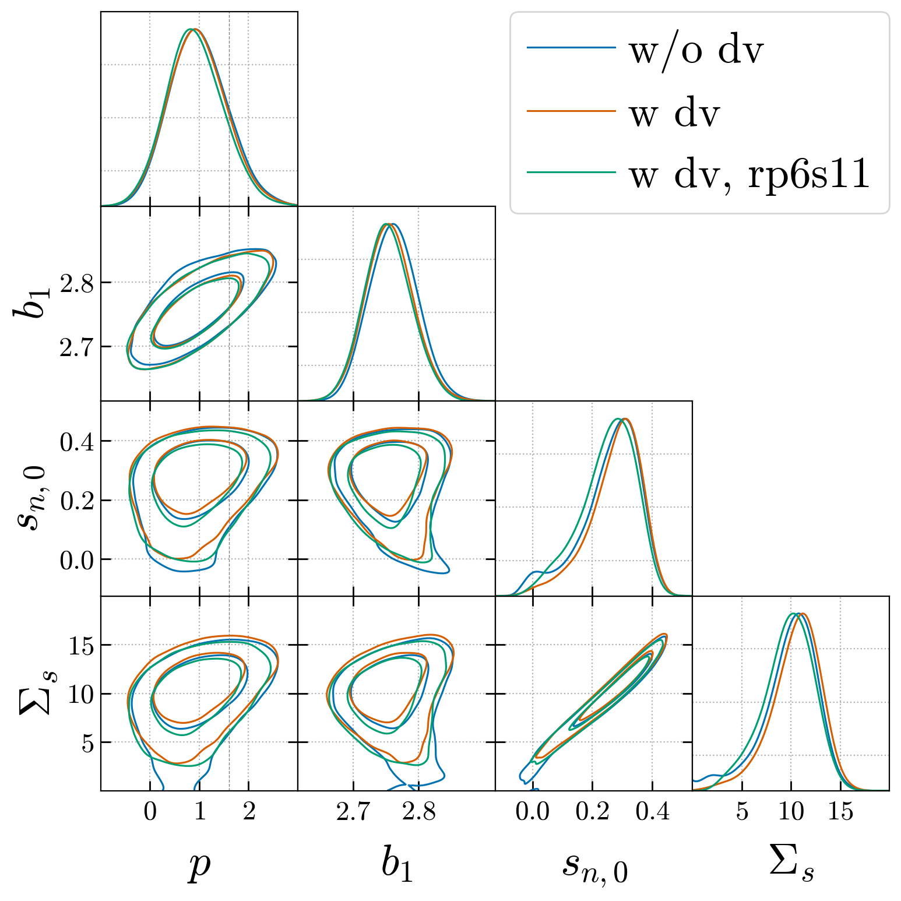
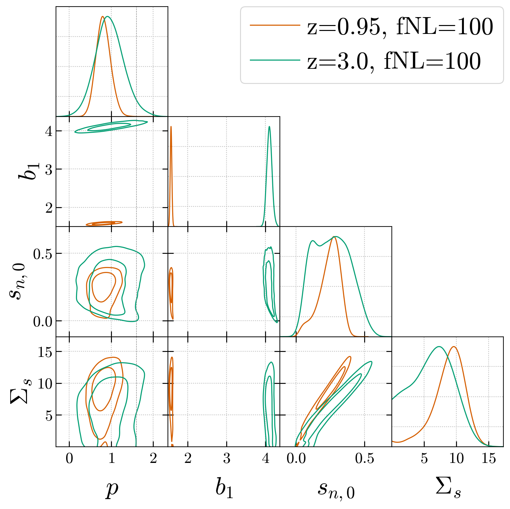
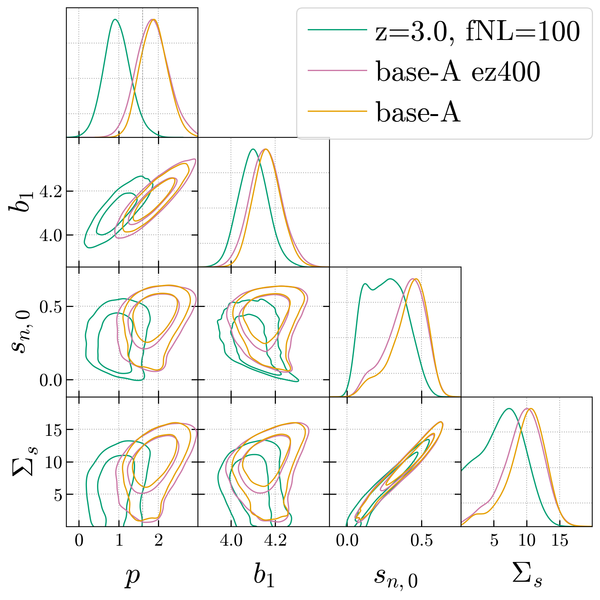

# Inference

We run inference with [desilike](https://github.com/cosmodesi/desilike). 

The standard analysis pipeline fixes $p=1$ for LRG and $p=1.6$ for QSO. 
However, we want to test whether the data^[small scale clusterings for each tracer and each redshift bin] prefer different values of $p$. To do this, we run inference with $p$ as a free parameter while fix $f_{\rm NL}$ to the simulation settings.

## Inference setup

The scripts to run the inference are in `launchers/` folder. 
In these scripts, we define a `name` for each inference run, which corresponds to a configuration file in `configs/`, and a folder in `out/fit_PNG_bias_v2/` to save the results. 
The main script to run the inference is `scripts/fit_p.py`. It has two modes: `b-p` mode fits $p$, while `bphi` mode fits $b_{\phi}$ directly. Both modes fixed $f_{\rm NL}$ to the simulation value.

## Post-processing

We also have scripts to post-process the chains, to be specific:
- Derive the posterior of $b_{\phi}$ from the chain of $p$ and add $b_{\phi}$ to the triangle plot, see `compare_with_bphi.sh` for an example. It contains two steps:
    1. `scripts/derive_chain.py`: derive the posterior of $b_{\phi}$ from the chain of $p$. It deal with one chain at a time. 
    2. After all chains needed are processed, we can plot the comparison of $b_{\phi}$ with `plot_chains/derived_bphi.py`. 

## Box tests

### QSOs at z2.0, fNL=30

In `tests/`, we compare 3 different settings of HOD model (w/o dv, w/ dv, w/ dv and cut 3 small scale bins), and run inference for each setting. The results of $p$ are quite same to each other.

### LRGs at z0.5, fNL=30

### Redshift evolution tests

We observe no redshift evolution of $p$ from z=0.95 to z=3.0, both at fNL=100.

### Assembly bias tests

We observe significant difference of $p$ between the base HOD model and the base-A HOD model at z=3.0, fNL=100.
