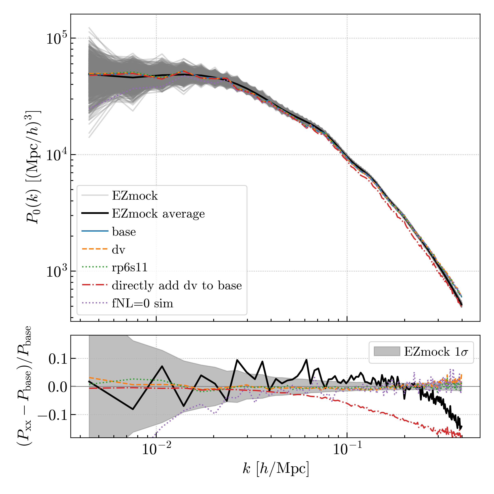

# test z4 

Here we compare 3 cases for HOD fitting of QSO-z4 sample. 
1. base: without redshift error (dv)
2. dv: add redshift error
3. rp6s11: with dv, cut three more bins in small scales

The differences of mock power spectrum is small (< 5%).
We also show the power spectrum if we directly add redshift error to the 'base' case. The differences of the scales we use (k<0.1 h/Mpc) are nearly less then 5%. While if we keep the same setting of fitting and the mock generation (i.e., 'dv' case), the differences are small in the full range.

The difference between the 3 cases (< 5%) are smaller than the difference between the mock data and EZmocks' average (< 10%), so we use the same EZmocks for covariance for all the 3 cases.

